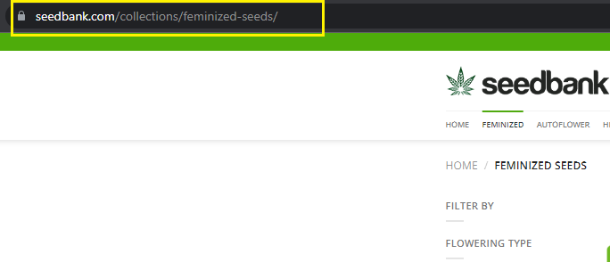
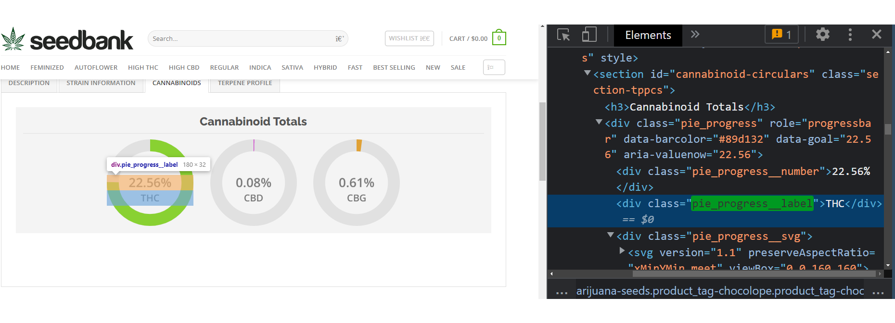
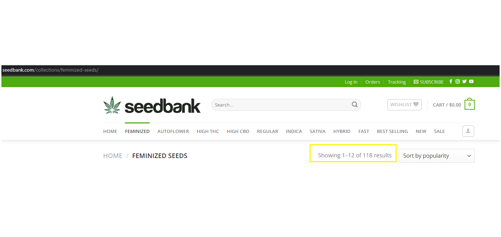
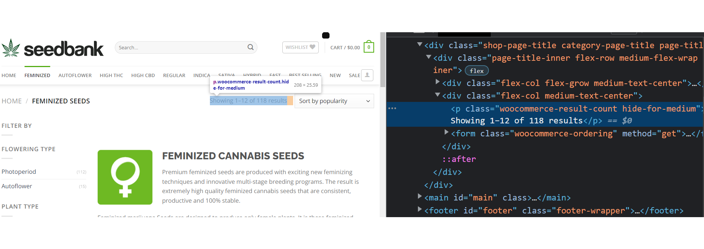

```{r setup, include=FALSE}
knitr::opts_chunk$set(echo = TRUE)
```

# Introdução

Neste projeto vou apresentar o trabalho final do curso de "Web scraping" da [Curso-R](www.curso-r.com). A ideia aqui é ter um primeiro contato com rapagem de dados de sites e também, ter uma entrega paralela como trabalho de conclusão do **VIII Curso de Cannabis Medicinal** da [Unifesp](https://sp.unifesp.br/epm/eventos-epm/viii-curso-de-cannabis-medicinal).
<br/>
<br/>

## Principais etapas

Veremos os seguintes pontos nesse documento:

* Descrição da página web acessada
* Como a requisição foi imitada?
* Como foi realizada a iteração?
* Como é o arquivo parseado?
* Documentação final
<br/>
<br/>

### Descrição da página web acessada

Alguns países possuem sites de vendas de sementes para cultivadores que desejam plantar 
maconha em suas próprias casas.

Um desses sites é a plataforma [Seed Bank](https://www.seedbank.com/) que foi projetada
para disponibilizar sementes premium para cultivadores com uma excelente variedade e excelentes
preços.
<br/>
<br/>
<br/>


<br/>
<br/>

Já dentro do site, o interesse está nas sementes feminizadas que são sementes de cannabis que possuem genética para produzir apenas ervas fêmeas.
<br/>
<br/>
<br/>

<br/>
<br/>

Os canabinoides são compostos naturais da planta. Os canabinoides mais famosos e conhecidos, são o delta-9-tetraidrocanabinol (THC) e o canabidiol (CBD). O THC é o componente psicoativo da Cannabis e o principal responsável  pelos efeitos físicos e psíquicos, a famosa brisa. Já o CBD tem o seu efeito principalmente ao interagir com receptores específicos nas células do cérebro e do corpo e é muito utilizado de forma medicinal por conta dos seus efeitos anticonvulsionantes, anti-inflamatórios e antitumorais. 

Para saber um pouco mais sobre o assunto, recomendo uma breve visita a página da wikipedia sobre [Canabidiol](https://pt.wikipedia.org/wiki/Canabidiol).

Voltando a página de interesse, foram coletadas as informações sobre os principais canabinoides de cada variedade de semente.
<br/>
<br/>
<br/>


<br/>
<br/>

Foram raspados os dados dos "Cannabinoid Totals" de cada uma das sementes feminizadas presentes no site.

Com essa pequena introdução e descrição da página, vamos começar a coleta de dados e análise de cluster das sementes.

Em primeiro lugar, foram carregados os pacotes que serão ferramentas para realização da raspagem de dados e também da clusterização.

  
```{r Carregar pacotes, echo=TRUE, message=FALSE, warning=FALSE}
pacotes <- c(
  "tidyverse",
  "cluster",
  "dendextend",
  "factoextra",
  "fpc",
  "gridExtra",
  "magrittr",
  "knitr",
  "kableExtra",
  "purrr",
  "xml2",
  "progressr",
  "purrr"
)


if (sum(as.numeric(!pacotes %in% installed.packages())) != 0) {
  instalador <- pacotes[!pacotes %in% installed.packages()]
  for (i in 1:length(instalador)) {
    install.packages(instalador, dependencies = T)
    break()
  }
  sapply(pacotes, require, character = T)
} else{
  sapply(pacotes, require, character = T)
}

```
<br/>
<br/>

### Como a requisição foi imitada?

O primeiro passo, foi localizar a URL principal que contém todas as sementes daquela página específica e realizar uma requisição para obter os links daquela página.

O que eu chamo de URL mãe, é essa url principal que foi a primeira a ser acessada.
<br/>
<br/>
<br/>




<br/>
<br/>

A requisição da url mãe foi realizada e o arquivo html foi salvo localmente através do código abaixo.

```{r}
u_links <- "https://www.seedbank.com/collections/feminized-seeds/"

r_links <-
  httr::GET(u_links,
            httr::write_disk("output/strains/feminized.html", overwrite = TRUE))
r_links
```
Depois de realizar essa requisição GET no site, obtivemos o status 200 e um arquivo de quase 200kB.
Com a página em mãos, foi necessário imitar a requisição que acessa o link de uma semente e para isso, os elementos da página foram inspecionados.
<br/>
<br/>
<br/>


<br/>
<br/>

Atráves da inspeção, foi possível localizar um elemento html que poderia ser acessado para retornar o link de todas sementes daquela página específica. Para acessar, utilizou-se o código abaixo utilizando o xpath do elemento e em seguida extraindo as urls (**href**) que obedecem ao filtro realizado com xpath.

```{r}
links <- r_links |>
  xml2::read_html() |>
  xml2::xml_find_all("//div[@class = 'add-to-cart-button']/a")

urls <- xml2::xml_attr(links, "href")

urls
```

Além das urls, também foi interessante obter o nome de cada uma das sementes, para construção do futuro dataset.
para obtenção dos nomes, o código abaixo foi executado, obtendo o nome da própria url da semente.

```{r}
txt <-
  xml2::url_relative(urls, "https://www.seedbank.com/products/") |>
  #remover traços e barras com regex
  stringr::str_replace_all("[[-/]]", " ") |>
  trimws()#remover espaço no final
txt
```

Com o link e nome das variedades de sementes em mãos, já temos duas colunas do nosso dataset. Agora vamos para o mais importante, a coleta dos nomes dos canabinoides e também dos valores percentuais de cada um deles.

Para isso, novamente foi necessário realizar uma inspeção de elementos na página, para obter os nomes de cada canabinoide da variedade.

<br/>
<br/>
<br/>



<br/>
<br/>

Com a informação do elemento html, os seguintes códigos foram executados para obtenção dos nomes dos canabinoides e também dos valores de cada um deles.

```{r}
html <- urls |>
    purrr::map(read_html)

  nome <- html |>
    purrr::map(xml_find_all, "//*[@class='pie_progress__label']") |>
    purrr::map(xml_text) |>
  #substitui retornos character(0) por THC. Foi necessario pois existem duas sementes que possuem uma estrutura diferente de apresentação dos valores dos canabinoides.
    lapply(\(x) if (identical(x, character(0)))
      "THC"
      else
        x)
nome
```

E para os valores.

```{r}
  
  valor <- html |>
    purrr::map(xml2::xml_find_all, "//*[@class='pie_progress']") |>
    purrr::map(xml2::xml_attr, "data-goal") |>
    purrr::map(as.numeric) |>
    lapply(\(x) if (identical(x, numeric(0)))
      0
      else
        x)
valor
```

E por fim, uma função para organizar os nomes dos canabinoides com os seus respectivos valores.

```{r}
dados_valores <-
    purrr::map2(nome, valor, \(x, y) tibble::tibble(name = x, value = y)) |>
    purrr::map_dfr(tidyr::pivot_wider) |>
    # substitui NAs por zero
    dplyr::mutate(dplyr::across(.fns = tidyr::replace_na, replace = 0))

dados_valores
```

A última etapa do processo, foi a etapa de união das colunas de valores com as colunas de nomes e links.

```{r}
  saida <- tibble::tibble(semente = txt, link = urls) |>
    dplyr::bind_cols(dados_valores) |>
    dplyr::mutate(link = stringr::str_squish(link))
saida
```

### Como foi realizada a iteração?

Para realizar a iteração, foi necessário entender primeiro, quantas páginas seriam acessadas e também quantos links seriam obtidos em cada página.

Esses valores podem ser encontrados na parte superior da página mãe.



Para coletar essa informação, foi necessário inspecionar o elemento e obter o xpath.


Em seguida, o seguinte código foi executado para obter o número de páginas e a quantidade total de itens.

```{r}
n_resultados <- r_links |>
  httr::content() |>
  xml2::xml_find_first("//p[@class = 'woocommerce-result-count hide-for-medium']") |>
  xml2::xml_text() |>
  stringr::str_squish() |>
  stringr::str_extract("[0-9][0-9][0-9]") |>
  as.numeric()

n_pags <- n_resultados %/% 12 + 1

n_resultados
n_pags
```
Com isso para iterar, foi criado um vetor para coletar todas as páginas.

```{r}
vetor_paginas <- 1:n_pags
```

E todas os trechos de código necessários para raspar os dados e coletar as informações, foram encapsulados em uma função.

```{r}
baixar_pagina <- function(pag, prog = NULL) {
  Sys.sleep(1)
  
  if (!is.null(prog))
    prog()
  u_pag <-
    glue::glue("https://www.seedbank.com/collections/feminized-seeds/page/{pag}/")
  httr::GET(u_pag, httr::write_disk(
    glue::glue("output/strains/pagina_{pag}.html"),
    overwrite = TRUE
  ))
  
  links <- u_pag |>
    xml2::read_html() |>
    xml2::xml_find_all("//div[@class = 'add-to-cart-button']/a")
  
  urls <- xml2::xml_attr(links, "href")
  
  html <- urls |>
    map(read_html)
  
  nome <- html |>
    map(xml_find_all, "//*[@class='pie_progress__label']") |>
    map(xml_text) |>
    lapply(\(x) if (identical(x, character(0)))
      "THC"
      else
        x)
  
  
  valor <- html |>
    map(xml2::xml_find_all, "//*[@class='pie_progress']") |>
    map(xml2::xml_attr, "data-goal") |>
    map(as.numeric) |>
    lapply(\(x) if (identical(x, numeric(0)))
      0
      else
        x)
  
  dados_valores <-
    map2(nome, valor, \(x, y) tibble::tibble(name = x, value = y)) |>
    map_dfr(tidyr::pivot_wider) |>
    # substitui NAs por zero
    dplyr::mutate(dplyr::across(.fns = tidyr::replace_na, replace = 0))
  
  txt <-
    xml2::url_relative(urls, "https://www.seedbank.com/products/") |>
    stringr::str_replace_all("[[/-]]", " ") |>
    trimws()
  
  saida <- tibble::tibble(semente = txt, link = urls) |>
    dplyr::bind_cols(dados_valores) |>
    dplyr::mutate(link = stringr::str_squish(link))
  
  return(saida)
}
```

Por último, essa função recebeu o vetor já criado e iterou por todas as páginas de interesse.

```{r}

progressr::with_progress({
  p <- progressr::progressor(n_pags)
  tab <- purrr::map_dfr(vetor_paginas, baixar_pagina, prog = p)
  Sys.sleep(1)
})
```


### Como é o arquivo parseado?

Os primeiros 50 resultados do arquivo parseado, pode ser visto na tabela abaixo. 
Essa tabela é o dataset final da raspagem de dados e insumo inicial para elaboração da analise de clusters.


```{r echo=FALSE, message=FALSE, warning=FALSE, paged.print=FALSE}
print(tab,n = 50)
```

### Documentação final

<br/>
<br/>
<br/>


<br/>
<br/>


semente: nome do produto ou variedade de semente vendida no site <br/>
link: url para página de produto da semente <br/>
THC: Percentual do canabinoide THC presente na variedade <br/>
CBD: Percentual do canabinoide CBD presente na variedade <br/>
CBG: Percentual do canabinoide CBG presente na variedade <br/>
CBN: Percentual do canabinoide CBG presente na variedade <br/>


# Parte 2 - Análise de cluster de canabinoides

A partir daqui, com os dados obtidos através do Web Scraping, vamos tentar identificar as variedades de sementes mais similares por quantidade percentual de canabinoides.

Essa parte do material, será a entrega para o **VIII Curso de Cannabis Medicinal** oferecido pela **UNIFESP**


Esse Curso de Cannabis Medicinal está na oitava edição e é o mais popular no Brasil. Uma referência para estudantes, acadêmicos, familiares de pacientes e quem trabalha ou quer trabalhar com quem busca acesso a produtos de saúde à base de Cannabis. O que começou nos salões da igreja do Padre Ticão, através de uma parceria entre a Unifesp, na presença do Cebrid e do Dr. Elisaldo Carlini, e de vários ativistas e coletivos. Desde a terceira edição o curso passou a ser online e já orientou milhares de inscritos.

De acordo com a programação, os principais objetivos do curso são: difundir conhecimento sobre a planta Cannabis, apresentar os possíveis medicamentos e tratamentos e seus derivados, trazem reflexões sobre a liberação da Cannabis para uso terapêutico e tratam sobre regulamentação em curso, com olhar para as esferas legislativas. Serão discutidas, ainda, formas de ampliar o acesso de pacientes aos tratamentos, de forma democrática e sustentável.


### Fundamentos da política nacional sobre drogas

O que fundamenta a Política Nacional sobre drogas é a [Lei Federal 11.343/2006](http://www.planalto.gov.br/ccivil_03/_ato2004-2006/2006/lei/l11343.htm), que em seu **§ 1º do art. 3º**, dispõe sobre a criação do Sistema Nacional de Políticas Públicas sobre Drogas - SISNAD, entendido como "**o conjunto ordenado de princípios, regras, critérios e recursos materiais e humanos que envolvem as políticas, planos, programas, ações e projetos sobre drogas**, incluindo-se nele, por adesão, os Sistemas de Políticas Públics sobre Drogas dos Estados, Distrito Federal e Nunicípios" que tem a finalidade de **articular, organizar e coordenar as atividades relacionadas com a prevenção do uso indevido, a atenção e a reinserção social dde usuários e dependentes de drogas e a repressão da produção não autorizada e do tráfico ilícito de drogas** (art. 3º, caput, incisos I e II, da Lei de Drogas)


### Fundamentação da análise

O principal objetivo de uma análise de agrupameno é o ordenamento e alocação das observações em grupos homogêneos internamente e heterogêneos entre si. A análise de agrupamentos é composta por um conjunto de técnicas exploratórias e que podem ser utilizadas quando a intenção é verificar se existem comportamentos semelhantes entre as observações (no nosso caso, cada semente de variedade é uma observação). 

Entendendo essas semelhanças, intenta-se criar grupos nos quais as sementes presentes em cada grupo, serão similares do ponto de vista da quantidade de canabinoides e da variação conjunta de cada um deles. Sendo assim, vamos começar entendendo um pouco melhor cada um dos canabinoides presentes na amostra.

#### THC

O THC é encontrado em todas as partes da planta, mas especialmente nas flores e resina das plantas fêmeas. Já a sua concentração em cada planta depende de vários fatores, tais como o tipo de solo, o clima, a época de colheita e assim por diante.

O THC foi isolado pela primeira vez em 1964 por Raphael Mechoulam, Yechiel Gaoni e Habib Edery, ao extraí-lo a partir do haxixe com éter de petróleo, seguido de repetidas cromatografias.

A maconha possui outros alucinógenos, mas o THC é o mais potente. Os efeitos da maconha devem-se praticamente a esse composto, pois o THC modifica a atividade cerebral da pessoa, fazendo com que ela tenha alucinações, delírios, diminua a sua percepção de tempo e espaço, além de poder levar a pessoa a ter acessos de ira e pânico. [fonte](https://mundoeducacao.uol.com.br/quimica/thcprincipal-componente-ativo-maconha.htm)

<br/>
<br/>
<br/>

#### CBD

"O canabidiol é uma substância encontrada na maconha, mas que não possui toxicidade se isolada. É legalizado em mais de 40 países e pesquisas têm mostrado sua eficácia em tratamentos de dores crônicas, espasmos musculares, convulsões e ansiedade.

No Brasil, o Canabidiol está registrado como medicamento na Anvisa, o que possibilita sua importação e, mais recentemente, sua fabricação em território nacional.

Apesar de ainda ser um tabu, a discussão sobre o uso da Cannabis medicinal está cada vez mais difundida e esperamos, por meio deste texto, esclarecer as principais dúvidas sobre o canabidiol." [fonte](https://farmaciamedicom.com.br/2022/01/20/canabidiol-cbd-o-que-e-para-que-serve-e-onde-comprar/)

<br/>
<br/>
<br/>

#### CBG

"Os efeitos farmacológicos do CBG descritos na literatura científica incluem: atividade antifúngica, anti-inseto e anti-inflamatória; atividade neuro-protetora; estimulação do apetite e aprimoramento do processo de morte das células cancerígenas “, explica Dr. Itzhak Kurek, CEO e co-fundador da Cannformatics, uma empresa de biotecnologia do norte da Califórnia que usa uma combinação de biologia (ciência da computação e matemática, entre outras disciplinas científicas) para melhorar a cannabis medicinal."[fonte](https://sechat.com.br/o-que-e-cbg-conheca-o-canabinoide-que-esta-sendo-apontado-como-a-proxima-grande-novidade/)

<br/>
<br/>
<br/>

#### CBN
"O CBN é um composto presente na cannabis que é criado quando o THC é deteriorado. Por este motivo, geralmente está presente em grandes quantidades quando a planta cannabis está mais velha. Embora a pesquisa atual sobre o CBN seja limitada, aos poucos os estudos realizados demonstram seus efeitos benéficos à saúde humana." [fonte](https://blog.drcannabis.com.br/cbn-conheca/)

<br/>
<br/>
<br/>

### Tratamento dos dados para clusterização

O primeiro passo, foi gerar uma base selecionando as variáveis e filtrando as sementes que não tinham a mesma estrutura de coleta dos dados. Para isso, o seguinte código foi executado.

```{r}
set.seed(123) 
base <- as.data.frame(tab)
base_filtrada <- dplyr::filter(base,
                               semente != "alaskan thunder fuck seeds" &
                                 semente != "sweet island skunk seeds")


feminized_seeds <- dplyr::select(base_filtrada, everything(), -link)
```

E com isso temos a seguinte base.

```{r}
glimpse(feminized_seeds)
```

Em seguida, as colunas receberam o nome de cada planta, pois o algoritmo de clusterização que será utilizado aceita apenas variáveis quantitativas que nesse caso, são os percentuais de cada canabinoide. Além disso, a base passou por um processo de padronização, conhecido como z-scores, para saber mais sobre esse procedimento, leia [aqui](https://datascience.eu/pt/matematica-e-estatistica/o-que-e-um-z-score/)

```{r}
rownames(feminized_seeds) <- feminized_seeds[, 1]
feminized_seeds <- feminized_seeds[,-1]

feminized_seeds.padronizado <- scale(feminized_seeds)
```

Em seguida, o algoritmo [k-means](https://en.wikipedia.org/wiki/K-means_clustering) foi utilizado para gerar os primeiros 2 clusters. Para isso, o código abaixo foi executado.

```{r}
#Cluster não hierarquico


feminized_seeds.k2 <-
  kmeans(feminized_seeds.padronizado, centers = 2)

#Visualizar os clusters

fviz_cluster(feminized_seeds.k2, data = feminized_seeds.padronizado, main = "Cluster k2")

```

Através do gráfico gerado, é possível perceber que existe uma quebra inicial interessante, quando consideramos o comportamento conjunto das variáveis para criar os grupos. 

Quando utilizamos essa técnica de clusterização não hierarquica, é necessário indicar apriori o número de clusters que será utilizado. Para isso, foram geradas algumas visualizações de diferentes conjuntos de clusters.

```{r}
#Criando Clusters

feminized_seeds.k3 <-
  kmeans(feminized_seeds.padronizado, centers = 3)
feminized_seeds.k4 <-
  kmeans(feminized_seeds.padronizado, centers = 4)
feminized_seeds.k5 <-
  kmeans(feminized_seeds.padronizado, centers = 5)
feminized_seeds.k6 <-
  kmeans(feminized_seeds.padronizado, centers = 6)

tipo_geom <- "points"
#Criar graficos
G2 <-
  fviz_cluster(feminized_seeds.k2, geom = tipo_geom, data = feminized_seeds.padronizado) + ggtitle("k = 2")
G3 <-
  fviz_cluster(feminized_seeds.k3, geom = tipo_geom, data = feminized_seeds.padronizado) + ggtitle("k = 3")
G4 <-
  fviz_cluster(feminized_seeds.k4, geom = tipo_geom, data = feminized_seeds.padronizado) + ggtitle("k = 4")
G5 <-
  fviz_cluster(feminized_seeds.k5, geom = tipo_geom, data = feminized_seeds.padronizado) + ggtitle("k = 5")
G6 <-
  fviz_cluster(feminized_seeds.k6, geom = tipo_geom, data = feminized_seeds.padronizado) + ggtitle("k = 6")


#Imprimir graficos na mesma tela
grid.arrange(G2, G3, G4, G5, G6, nrow = 2)
```

O método Elbow foi utilizado para determinação do número ótimo de clusters. Para saber mais sobre o método Elbow, leia [aqui](https://rpubs.com/diascodes/770518)

```{r}
#VERIFICANDO ELBOW
fviz_nbclust(feminized_seeds.padronizado, kmeans, method = "wss") +
  geom_vline(xintercept = 5, linetype = 6)
```

Foi tomada a decisão de trabalhar com 5 clusters de sementes e uma forma de avaliar as características desses clusters é gerando um dataset de resumo, agrupando as observações e calculando as médias de cada grupo.

```{r}
fit <- data.frame(feminized_seeds.k5$cluster)

feminized_seeds_fit <- cbind(base_filtrada, fit)

resumo_medio <- feminized_seeds_fit |>
  group_by(feminized_seeds.k5.cluster) |>
  dplyr::summarise(
    n = n(),
    THC = mean(THC),
    CBD = mean(CBD),
    CBG = mean(CBG),
    CBN = mean(CBN)
  ) 

print(resumo_medio)
```
Com os clusters formados, é possível ter uma ideia do percentual médio de cada canabinoide em cada cluster. 

O cluster 4 por exemplo, possui apenas 1 variedade de semente e isso ocorreu pois é possível que essa semente específica tenha no comportamento conjunto de suas variáveis métricas, valores que são consideravelmente diferentes para a quantidade de clusters que fora considerada nessa análise.

Com esses resultados e pensando na realização de cultivo e a grande variedade de sementes presentes no banco, é possível avaliar cada variedade em cada grupo, já com uma ideia média do percentual de cada canabinoide coletado em cada semente.


Para acessar os dados desse relatório, acesse o [diretório desse projeto](https://github.com/DuhBenhur/cannabis) no **Github**. Lá na pasta outputs, existe um arquivo .csv com os resultado dos clusters e de quais sementes fazem parte deles.

Espero que tenha ficado legal para você que lê. Foi muito divertido fazer esse trabalho :-) <br/>
Todo feedback é bem vindo!

<br/>
<br/>
<br/>

Até mais!!
<br/>
<br/>
Eduardo Ben- Hur - [Linkedin](https://www.linkedin.com/in/eduardobenhur/)


